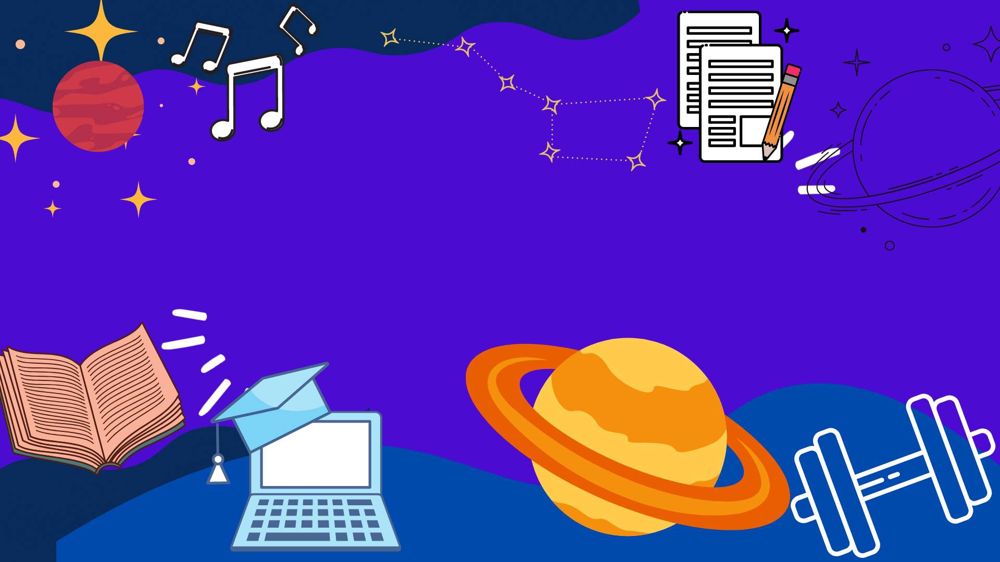

<h1 align="center">Hi 👋, I'm Sakshi</h1>
<h3 align="center">An inquisitive person who likes to code :)</h3>

  

- 👨‍🎓 I’m Sakshi Thombre currently studying in **sophomore year at DYPCOE.**

- 🌱 I’m currently learning **Android development**

- 💻 I enjoy web development and I am also interested **in competitive programming ..**

- 📫 How to reach me **isakshy18@gmail.com**

- ⚡ Fun fact **I like to paint**

<h3 align="left">Connect with me:</h3>

<h3 align="left">Languages and Tools:</h3>

           

